# Authorizer Service

A robust authentication and authorization service built with clean architecture principles, providing JWT-based authentication and role-based access control (RBAC).

## Architecture Overview

This service follows **Clean Architecture** principles with clear separation of concerns across four main layers:

### Layer Structure

```
┌─────────────────────────────────────────────────────────┐
│                    Delivery Layer                        │
│         (HTTP Handlers, Middleware, Router)              │
└─────────────────────────────────────────────────────────┘
                          ↓
┌─────────────────────────────────────────────────────────┐
│                    UseCase Layer                         │
│           (Application Business Logic)                   │
└─────────────────────────────────────────────────────────┘
                          ↓
┌─────────────────────────────────────────────────────────┐
│                    Domain Layer                          │
│    (Entities, Repository Interfaces, Domain Services)    │
└─────────────────────────────────────────────────────────┘
                          ↑
┌─────────────────────────────────────────────────────────┐
│                 Infrastructure Layer                     │
│    (Database, Cache, Auth, Config, Logger)               │
└─────────────────────────────────────────────────────────┘
```

### Dependency Rules

1. **Domain Layer** (innermost): No dependencies on other layers - pure business logic
2. **UseCase Layer**: Depends only on Domain layer - orchestrates workflows
3. **Infrastructure Layer**: Implements Domain interfaces - handles external dependencies
4. **Delivery Layer**: Depends on Domain and UseCase - handles HTTP concerns
5. **Main (cmd/api)**: Wires everything together - dependency injection happens here

### Architecture Diagram

The following diagram illustrates the complete dependency flow from `main.go` through all architectural layers:

```mermaid
graph TB
    subgraph "cmd/api/main.go - Dependency Injection Container"
        Main[main.go]
    end

    subgraph "Infrastructure Layer - External Dependencies"
        Config[Config Service]
        Logger[Logger Service]
        PostgreSQL[(PostgreSQL Database)]
        Redis[(Redis Cache)]
        JWTService[JWT Service]
        JWKSService[JWKS Service]
    end

    subgraph "Repository Implementations"
        UserRepo[User Repository]
        RoleRepo[Role Repository]
        PermRepo[Permission Repository]
        AppRepo[Application Repository]
        UserRoleRepo[UserRole Repository]
        RolePermRepo[RolePermission Repository]
        AuthRepo[Auth Repository - Redis]
    end

    subgraph "Domain Layer - Business Logic"
        AuthDomainService[Auth Domain Service]
        UserEntity[User Entity]
        RoleEntity[Role Entity]
        PermEntity[Permission Entity]
        RepoInterfaces[Repository Interfaces]
    end

    subgraph "UseCase Layer - Application Logic"
        AuthUC[Auth UseCase]
        UserUC[User UseCase]
        RoleUC[Role UseCase]
        PermUC[Permission UseCase]
        AppUC[Application UseCase]
    end

    subgraph "Delivery Layer - HTTP Interface"
        AuthHandler[Auth Handler]
        UserHandler[User Handler]
        RoleHandler[Role Handler]
        PermHandler[Permission Handler]
        AppHandler[Application Handler]
        HealthHandler[Health Handler]
        JWTMiddleware[JWT Middleware]
        Router[Router]
    end

    %% Main initialization flow
    Main -->|1. Initialize| Config
    Main -->|2. Initialize| Logger
    Main -->|3. Connect| PostgreSQL
    Main -->|4. Connect| Redis
    Main -->|5. Create| UserRepo
    Main -->|5. Create| RoleRepo
    Main -->|5. Create| PermRepo
    Main -->|5. Create| AppRepo
    Main -->|5. Create| UserRoleRepo
    Main -->|5. Create| RolePermRepo
    Main -->|5. Create| AuthRepo
    Main -->|6. Create| AuthDomainService
    Main -->|7. Create| JWTService
    Main -->|7. Create| JWKSService
    Main -->|8. Create| AuthUC
    Main -->|8. Create| UserUC
    Main -->|8. Create| RoleUC
    Main -->|8. Create| PermUC
    Main -->|8. Create| AppUC
    Main -->|9. Create| AuthHandler
    Main -->|9. Create| UserHandler
    Main -->|9. Create| RoleHandler
    Main -->|9. Create| PermHandler
    Main -->|9. Create| AppHandler
    Main -->|9. Create| HealthHandler
    Main -->|10. Create| JWTMiddleware
    Main -->|11. Setup| Router

    %% Repository dependencies
    UserRepo -.->|implements| RepoInterfaces
    RoleRepo -.->|implements| RepoInterfaces
    PermRepo -.->|implements| RepoInterfaces
    AppRepo -.->|implements| RepoInterfaces
    UserRoleRepo -.->|implements| RepoInterfaces
    RolePermRepo -.->|implements| RepoInterfaces
    AuthRepo -.->|implements| RepoInterfaces
    UserRepo -->|uses| PostgreSQL
    RoleRepo -->|uses| PostgreSQL
    PermRepo -->|uses| PostgreSQL
    AppRepo -->|uses| PostgreSQL
    UserRoleRepo -->|uses| PostgreSQL
    RolePermRepo -->|uses| PostgreSQL
    AuthRepo -->|uses| Redis

    %% Domain service dependencies
    AuthDomainService -->|depends on| UserRoleRepo
    AuthDomainService -->|depends on| RoleRepo
    AuthDomainService -->|depends on| RolePermRepo
    AuthDomainService -->|depends on| AppRepo

    %% Infrastructure service dependencies
    JWTService -->|uses| Logger

    %% UseCase dependencies
    AuthUC -->|depends on| AuthRepo
    AuthUC -->|depends on| UserRepo
    AuthUC -->|depends on| AuthDomainService
    AuthUC -->|depends on| JWTService
    AuthUC -->|uses| Logger
    UserUC -->|depends on| UserRepo
    UserUC -->|depends on| RoleRepo
    UserUC -->|depends on| UserRoleRepo
    UserUC -->|uses| Logger
    RoleUC -->|depends on| RoleRepo
    RoleUC -->|depends on| AppRepo
    RoleUC -->|depends on| PermRepo
    RoleUC -->|depends on| RolePermRepo
    RoleUC -->|uses| Logger
    PermUC -->|depends on| PermRepo
    PermUC -->|depends on| AppRepo
    PermUC -->|uses| Logger
    AppUC -->|depends on| AppRepo
    AppUC -->|uses| Logger

    %% Handler dependencies
    AuthHandler -->|depends on| AuthUC
    AuthHandler -->|depends on| JWKSService
    AuthHandler -->|uses| Config
    AuthHandler -->|uses| Logger
    UserHandler -->|depends on| UserUC
    UserHandler -->|uses| Logger
    RoleHandler -->|depends on| RoleUC
    RoleHandler -->|uses| Logger
    PermHandler -->|depends on| PermUC
    PermHandler -->|uses| Logger
    AppHandler -->|depends on| AppUC
    AppHandler -->|uses| Logger
    HealthHandler -->|uses| Logger

    %% Middleware dependencies
    JWTMiddleware -->|depends on| JWTService
    JWTMiddleware -->|uses| Config
    JWTMiddleware -->|uses| Logger

    %% Router dependencies
    Router -->|registers| AuthHandler
    Router -->|registers| UserHandler
    Router -->|registers| RoleHandler
    Router -->|registers| PermHandler
    Router -->|registers| AppHandler
    Router -->|registers| HealthHandler
    Router -->|applies| JWTMiddleware

    %% Domain entities (shown for completeness)
    AuthDomainService -.->|works with| UserEntity
    AuthDomainService -.->|works with| RoleEntity
    AuthDomainService -.->|works with| PermEntity

    classDef mainClass fill:#e1f5ff,stroke:#01579b,stroke-width:3px
    classDef infraClass fill:#fff3e0,stroke:#e65100,stroke-width:2px
    classDef repoClass fill:#f3e5f5,stroke:#4a148c,stroke-width:2px
    classDef domainClass fill:#e8f5e9,stroke:#1b5e20,stroke-width:2px
    classDef usecaseClass fill:#fff9c4,stroke:#f57f17,stroke-width:2px
    classDef deliveryClass fill:#fce4ec,stroke:#880e4f,stroke-width:2px

    class Main mainClass
    class Config,Logger,PostgreSQL,Redis,JWTService,JWKSService infraClass
    class UserRepo,RoleRepo,PermRepo,AppRepo,UserRoleRepo,RolePermRepo,AuthRepo repoClass
    class AuthDomainService,UserEntity,RoleEntity,PermEntity,RepoInterfaces domainClass
    class AuthUC,UserUC,RoleUC,PermUC,AppUC usecaseClass
    class AuthHandler,UserHandler,RoleHandler,PermHandler,AppHandler,HealthHandler,JWTMiddleware,Router deliveryClass
```



**Key Observations:**

1. **Dependency Inversion Principle**: Domain layer defines interfaces, infrastructure implements them
2. **Unidirectional Flow**: Dependencies flow inward toward the domain layer
3. **Explicit Wiring**: All dependencies are constructed and injected in `main.go`
4. **Layer Isolation**: Each layer can be tested independently with mocks
5. **No Circular Dependencies**: Clean dependency graph ensures maintainability

## Project Structure

```
authorizer/
├── cmd/api/
│   └── main.go                    # Application entry point, DI container
├── internal/
│   ├── delivery/http/
│   │   ├── handler/               # HTTP request handlers
│   │   ├── middleware/            # Authentication & authorization middleware
│   │   └── router/                # Route definitions
│   ├── domain/
│   │   ├── entity/                # Business entities (User, Role, Permission, etc.)
│   │   ├── repository/            # Repository interfaces
│   │   └── service/               # Domain service interfaces
│   ├── infrastructure/
│   │   ├── auth/                  # JWT & JWKS implementation
│   │   ├── config/                # Configuration management
│   │   ├── logger/                # Structured logging
│   │   └── persistence/           # Database & cache implementations
│   │       ├── postgres/          # PostgreSQL repositories
│   │       └── redis/             # Redis cache repositories
│   └── usecase/
│       ├── auth/                  # Authentication use cases
│       ├── user/                  # User management use cases
│       ├── role/                  # Role management use cases
│       ├── permission/            # Permission management use cases
│       └── application/           # Application management use cases
├── pkg/                           # Shared utilities
└── config.yaml                    # Application configuration
```

### Key Directories

- **cmd/api/main.go**: All dependency injection happens here. Infrastructure → Repositories → Services → UseCases → Handlers → Router
- **internal/domain**: Core business logic with no external dependencies
- **internal/usecase**: Application workflows that orchestrate domain logic
- **internal/infrastructure**: Concrete implementations of external dependencies
- **internal/delivery**: HTTP layer that translates requests to use case calls

## Dependency Injection

This service uses **explicit constructor-based dependency injection** with all wiring done in `main.go`.

### DI Pattern

Every component receives its dependencies through constructor functions:

```go
// Domain Service
func NewAuthService(
    userRoleRepo repository.UserRoleRepository,
    roleRepo repository.RoleRepository,
    rolePermRepo repository.RolePermissionRepository,
    appRepo repository.ApplicationRepository,
) service.AuthService

// UseCase
func NewAuthUseCase(
    userRepo repository.UserRepository,
    authRepo repository.AuthRepository,
    authService service.AuthService,
    jwtService auth.JWTService,
    config *config.Config,
    logger logger.Logger,
) UseCase

// Handler
func NewAuthHandler(
    authUC usecase.AuthUseCase,
    jwksService auth.JWKSService,
    config *config.Config,
    logger logger.Logger,
) *AuthHandler
```

### Initialization Order in main.go

```go
func main() {
    // 1. Load configuration
    cfg, err := config.Load()
    
    // 2. Initialize infrastructure
    logger := logger.New()
    db := initDatabase(cfg, logger)
    redis := initRedis(cfg, logger)
    
    // 3. Initialize repositories
    userRepo := postgres.NewUserRepository(db)
    roleRepo := postgres.NewRoleRepository(db)
    // ... other repositories
    
    // 4. Initialize services
    authService := service.NewAuthService(userRoleRepo, roleRepo, rolePermRepo, appRepo)
    jwtService := auth.NewJWTService(logger)
    jwksService := auth.NewJWKSService()
    
    // 5. Initialize use cases
    authUC := usecase.NewAuthUseCase(userRepo, authRepo, authService, jwtService, cfg, logger)
    userUC := usecase.NewUserUseCase(userRepo, logger)
    // ... other use cases
    
    // 6. Initialize handlers
    authHandler := handler.NewAuthHandler(authUC, jwksService, cfg, logger)
    userHandler := handler.NewUserHandler(userUC, logger)
    // ... other handlers
    
    // 7. Initialize middleware
    jwtMiddleware := middleware.JWTAuthMiddleware(jwtService, cfg, logger)
    
    // 8. Setup router
    e := echo.New()
    router.Setup(e, &router.RouterConfig{
        AuthHandler:   authHandler,
        UserHandler:   userHandler,
        JWTMiddleware: jwtMiddleware,
        Logger:        logger,
    })
    
    // 9. Start server
    logger.Info("Starting server", logger.Field{Key: "port", Value: cfg.Server.Port})
    e.Start(fmt.Sprintf(":%d", cfg.Server.Port))
}
```

### Benefits

- **Explicit Dependencies**: Easy to see what each component needs
- **Testability**: Mock any dependency by implementing its interface
- **No Hidden State**: No global variables or singletons
- **Compile-Time Safety**: Missing dependencies cause compilation errors

## Adding New Features

Follow this step-by-step guide to add new features while maintaining clean architecture:

### Step 1: Define Domain Entity

Create your entity in `internal/domain/entity/`:

```go
// internal/domain/entity/organization.go
package entity

type Organization struct {
    ID          string
    Name        string
    Description string
    CreatedAt   time.Time
    UpdatedAt   time.Time
}
```

### Step 2: Define Repository Interface

Create the repository interface in `internal/domain/repository/`:

```go
// internal/domain/repository/organization.go
package repository

import (
    "context"
    "github.com/yourusername/authorizer/internal/domain/entity"
)

type OrganizationRepository interface {
    Create(ctx context.Context, org *entity.Organization) error
    GetByID(ctx context.Context, id string) (*entity.Organization, error)
    Update(ctx context.Context, org *entity.Organization) error
    Delete(ctx context.Context, id string) error
    List(ctx context.Context, limit, offset int) ([]*entity.Organization, error)
}
```

### Step 3: Implement Repository

Implement the repository in `internal/infrastructure/persistence/postgres/`:

```go
// internal/infrastructure/persistence/postgres/organization_repository.go
package postgres

import (
    "context"
    "github.com/jackc/pgx/v5/pgxpool"
    "github.com/yourusername/authorizer/internal/domain/entity"
    "github.com/yourusername/authorizer/internal/domain/repository"
)

type organizationRepository struct {
    db *pgxpool.Pool
}

func NewOrganizationRepository(db *pgxpool.Pool) repository.OrganizationRepository {
    return &organizationRepository{db: db}
}

func (r *organizationRepository) Create(ctx context.Context, org *entity.Organization) error {
    query := `INSERT INTO organizations (id, name, description) VALUES ($1, $2, $3)`
    _, err := r.db.Exec(ctx, query, org.ID, org.Name, org.Description)
    return err
}

// Implement other methods...
```

### Step 4: Create UseCase

Create use case in `internal/usecase/organization/`:

```go
// internal/usecase/organization/interface.go
package organization

import "context"

type UseCase interface {
    Create(ctx context.Context, req *CreateRequest) (*CreateResponse, error)
    GetByID(ctx context.Context, id string) (*OrganizationResponse, error)
    Update(ctx context.Context, id string, req *UpdateRequest) error
    Delete(ctx context.Context, id string) error
    List(ctx context.Context, limit, offset int) ([]*OrganizationResponse, error)
}

// internal/usecase/organization/usecase.go
package organization

import (
    "context"
    "github.com/yourusername/authorizer/internal/domain/repository"
    "github.com/yourusername/authorizer/internal/infrastructure/logger"
)

type useCase struct {
    orgRepo repository.OrganizationRepository
    logger  logger.Logger
}

func NewUseCase(
    orgRepo repository.OrganizationRepository,
    logger logger.Logger,
) UseCase {
    return &useCase{
        orgRepo: orgRepo,
        logger:  logger,
    }
}

func (uc *useCase) Create(ctx context.Context, req *CreateRequest) (*CreateResponse, error) {
    // Validation
    if req.Name == "" {
        return nil, errors.New("name is required")
    }
    
    // Create entity
    org := &entity.Organization{
        ID:          generateID(),
        Name:        req.Name,
        Description: req.Description,
    }
    
    // Save to repository
    if err := uc.orgRepo.Create(ctx, org); err != nil {
        uc.logger.Error("failed to create organization", logger.Field{Key: "error", Value: err})
        return nil, err
    }
    
    return &CreateResponse{ID: org.ID}, nil
}
```

### Step 5: Create Handler

Create handler in `internal/delivery/http/handler/`:

```go
// internal/delivery/http/handler/organization_handler.go
package handler

import (
    "net/http"
    "github.com/labstack/echo/v4"
    "github.com/yourusername/authorizer/internal/usecase/organization"
    "github.com/yourusername/authorizer/internal/infrastructure/logger"
)

type OrganizationHandler struct {
    orgUC  organization.UseCase
    logger logger.Logger
}

func NewOrganizationHandler(
    orgUC organization.UseCase,
    logger logger.Logger,
) *OrganizationHandler {
    return &OrganizationHandler{
        orgUC:  orgUC,
        logger: logger,
    }
}

func (h *OrganizationHandler) Create() echo.HandlerFunc {
    return func(c echo.Context) error {
        var req organization.CreateRequest
        if err := c.Bind(&req); err != nil {
            return c.JSON(http.StatusBadRequest, map[string]string{"error": err.Error()})
        }
        
        resp, err := h.orgUC.Create(c.Request().Context(), &req)
        if err != nil {
            return c.JSON(http.StatusInternalServerError, map[string]string{"error": err.Error()})
        }
        
        return c.JSON(http.StatusCreated, resp)
    }
}
```

### Step 6: Wire in main.go

Add initialization in `cmd/api/main.go`:

```go
func main() {
    // ... existing initialization
    
    // Repository
    orgRepo := postgres.NewOrganizationRepository(db)
    
    // UseCase
    orgUC := organization.NewUseCase(orgRepo, logger)
    
    // Handler
    orgHandler := handler.NewOrganizationHandler(orgUC, logger)
    
    // Router
    router.Setup(e, &router.RouterConfig{
        // ... existing handlers
        OrganizationHandler: orgHandler,
    })
}
```

### Step 7: Add Routes

Update `internal/delivery/http/router/router.go`:

```go
func Setup(e *echo.Echo, cfg *RouterConfig) error {
    // ... existing routes
    
    // Organization routes
    orgGroup := api.Group("/organizations")
    orgGroup.POST("", cfg.OrganizationHandler.Create(), cfg.JWTMiddleware)
    orgGroup.GET("/:id", cfg.OrganizationHandler.GetByID(), cfg.JWTMiddleware)
    orgGroup.PUT("/:id", cfg.OrganizationHandler.Update(), cfg.JWTMiddleware)
    orgGroup.DELETE("/:id", cfg.OrganizationHandler.Delete(), cfg.JWTMiddleware)
    
    return nil
}
```

## Testing

### Running Tests

```bash
# Run all tests
go test ./...

# Run tests with coverage
go test -cover ./...

# Run tests with verbose output
go test -v ./...

# Run specific package tests
go test ./internal/usecase/auth/...

# Run with race detection
go test -race ./...
```

### Test Structure

```
internal/
├── domain/service/
│   └── auth_service_test.go       # Domain service unit tests
├── usecase/auth/
│   └── usecase_test.go            # UseCase unit tests
├── delivery/http/handler/
│   └── auth_handler_test.go       # Handler unit tests
├── infrastructure/auth/
│   └── jwt_service_test.go        # Infrastructure unit tests
└── testing/
    ├── structural/                # Architecture compliance tests
    ├── property/                  # Property-based tests
    └── comparison/                # Behavioral comparison tests
```

### Writing Tests

**Unit Test Example:**

```go
func TestAuthUseCase_Login(t *testing.T) {
    // Setup mocks
    mockUserRepo := &MockUserRepository{}
    mockAuthService := &MockAuthService{}
    mockJWTService := &MockJWTService{}
    
    // Create use case
    uc := NewAuthUseCase(mockUserRepo, mockAuthRepo, mockAuthService, mockJWTService, cfg, logger)
    
    // Test
    result, err := uc.Login(context.Background(), &LoginRequest{
        Email:    "test@example.com",
        Password: "password123",
    })
    
    // Assertions
    assert.NoError(t, err)
    assert.NotEmpty(t, result.AccessToken)
}
```

**Integration Test Example:**

```go
func TestAuthHandler_Login_Integration(t *testing.T) {
    // Setup test database
    db := setupTestDB(t)
    defer db.Close()
    
    // Initialize real dependencies
    userRepo := postgres.NewUserRepository(db)
    authUC := usecase.NewAuthUseCase(userRepo, ...)
    handler := handler.NewAuthHandler(authUC, ...)
    
    // Create test request
    req := httptest.NewRequest(http.MethodPost, "/auth/login", body)
    rec := httptest.NewRecorder()
    
    // Execute
    err := handler.Login()(e.NewContext(req, rec))
    
    // Verify
    assert.NoError(t, err)
    assert.Equal(t, http.StatusOK, rec.Code)
}
```

### Test Coverage Goals

- Unit tests: Minimum 80% coverage per layer
- Integration tests: All critical paths covered
- Property-based tests: Verify architectural compliance

## Configuration

### Environment Variables

```bash
# Server
SERVER_PORT=8080

# Database
DB_HOST=localhost
DB_PORT=5432
DB_USER=postgres
DB_PASSWORD=postgres
DB_NAME=authorizer

# Redis
REDIS_HOST=localhost
REDIS_PORT=6379
REDIS_PASSWORD=
REDIS_DB=0

# JWT Keys (see JWT Configuration section below)
JWT_PRIVATE_KEY_PATH=./private.pem
JWT_PUBLIC_KEY_PATH=./public.pem
JWT_KEY_ID=key-1
```

### Configuration File

Create `config.yaml`:

```yaml
server:
  port: 8080

database:
  host: localhost
  port: 5432
  user: postgres
  password: postgres
  dbname: authorizer

redis:
  host: localhost
  port: 6379
  password: ""
  db: 0

jwt:
  private_key_path: ./private.pem
  public_key_path: ./public.pem
  key_id: key-1
```

## JWT Configuration (RS256)

The application loads private/public keys for JWT in the following order:

1. **Environment variable (PEM string)**  
   If `JWT_PRIVATE_KEY` and `JWT_PUBLIC_KEY` are set (PEM content), keys are loaded from env (suitable for `secretKeyRef`).

2. **File**  
   Tries in order: `JWT_PRIVATE_KEY_PATH` / `JWT_PUBLIC_KEY_PATH` → `./private.pem` / `./public.pem` → `/app/secrets/private.pem` / `/app/secrets/public.pem` (K8s secret mount).

### Option 1: Mount Secret as Volume (Recommended)

Create secret from PEM files:
```bash
kubectl create secret generic jwt-keys \
  --from-file=private.pem=./private.pem \
  --from-file=public.pem=./public.pem
```

In Deployment, mount secret to `/app/secrets`:
```yaml
volumeMounts:
  - name: jwt-keys
    mountPath: /app/secrets
    readOnly: true
volumes:
  - name: jwt-keys
    secret:
      secretName: jwt-keys
```

Without additional env vars, the application will automatically use `/app/secrets/private.pem` and `/app/secrets/public.pem` if default path files don't exist.

Or set path explicitly:
```yaml
env:
  - name: JWT_PRIVATE_KEY_PATH
    value: /app/secrets/private.pem
  - name: JWT_PUBLIC_KEY_PATH
    value: /app/secrets/public.pem
```

### Option 2: Secret as Environment Variable

Mount keys as env (raw PEM content):
```yaml
env:
  - name: JWT_PRIVATE_KEY
    valueFrom:
      secretKeyRef:
        name: jwt-keys
        key: private.pem
  - name: JWT_PUBLIC_KEY
    valueFrom:
      secretKeyRef:
        name: jwt-keys
        key: public.pem
```

## API Endpoints

### Authentication
- `POST /api/v1/auth/login` - User login
- `POST /api/v1/auth/logout` - User logout
- `GET /api/v1/auth/.well-known/jwks.json` - JWKS endpoint

### Users
- `GET /api/v1/users` - List users
- `GET /api/v1/users/:id` - Get user by ID
- `POST /api/v1/users` - Create user
- `PUT /api/v1/users/:id` - Update user
- `DELETE /api/v1/users/:id` - Delete user

### Roles
- `GET /api/v1/roles` - List roles
- `GET /api/v1/roles/:id` - Get role by ID
- `POST /api/v1/roles` - Create role
- `PUT /api/v1/roles/:id` - Update role
- `DELETE /api/v1/roles/:id` - Delete role

### Permissions
- `GET /api/v1/permissions` - List permissions
- `GET /api/v1/permissions/:id` - Get permission by ID
- `POST /api/v1/permissions` - Create permission
- `PUT /api/v1/permissions/:id` - Update permission
- `DELETE /api/v1/permissions/:id` - Delete permission

### Applications
- `GET /api/v1/applications` - List applications
- `GET /api/v1/applications/:id` - Get application by ID
- `POST /api/v1/applications` - Create application
- `PUT /api/v1/applications/:id` - Update application
- `DELETE /api/v1/applications/:id` - Delete application

## Development

### Prerequisites

- Go 1.21 or higher
- PostgreSQL 14 or higher
- Redis 6 or higher

### Setup

```bash
# Clone repository
git clone <repository-url>
cd authorizer

# Install dependencies
go mod download

# Setup database
make migrate-up

# Generate JWT keys
make generate-keys

# Run application
go run cmd/api/main.go
```

### Database Migrations

```bash
# Run migrations
make migrate-up

# Rollback migrations
make migrate-down

# Create new migration
migrate create -ext sql -dir internal/infrastructure/migrations -seq <migration_name>
```

## License

[Your License Here]
